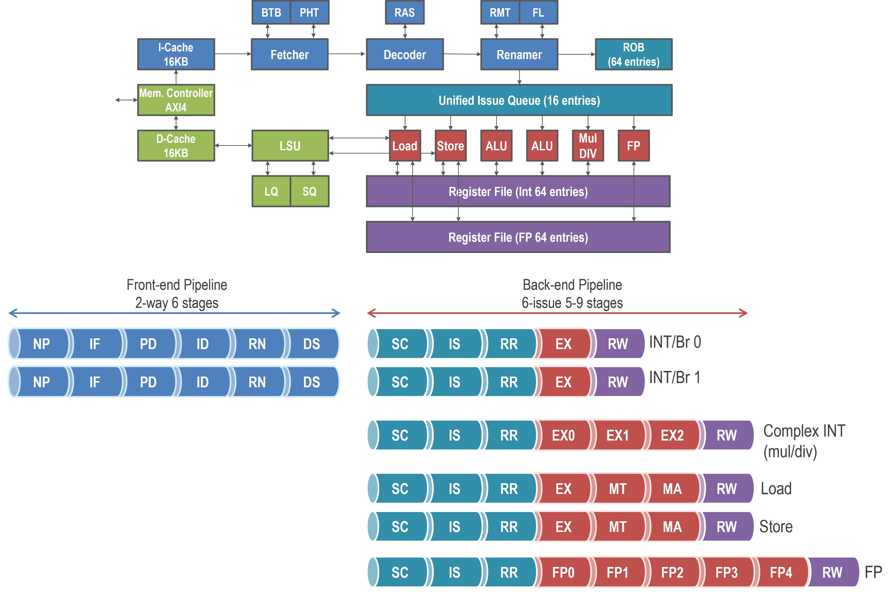
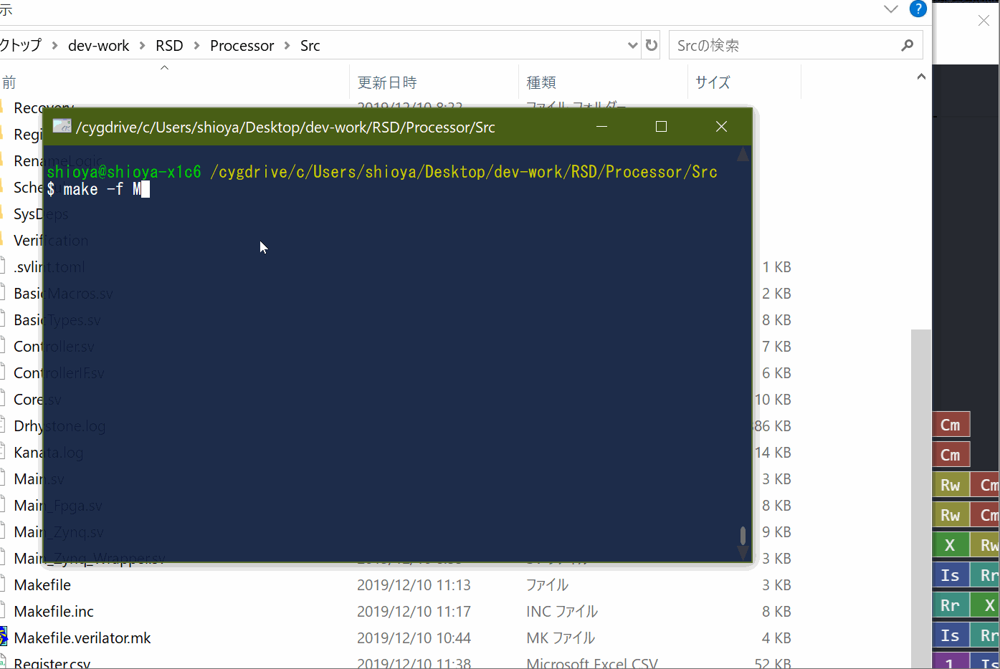

# RSD RISC-V Out-of-Order Superscalar Processor 

RSD is a 32-bit RISC-V out-of-order superscalar processor core.
RSD is very fast due to aggressive OoO features, while it is very compact and can be synthesized for small FPGAs. 
The key features of RSD are as follows:

* ISA
    * Support RV32IMF
    * Support Zephyr applications
* Microarchitecture
    * 2-fetch front-end and 6-issue back-end pipelines
    * Up to 64 instructions are in-flight.
        * These parameters can be configurable.
    * A high-speed speculative instruction scheduler with a replay mechanism
    * Speculative OoO load/store execution and dynamic memory disambiguation
    * Non-blocking L1 data cache
    * Support AXI4 bus
* Implementation
    * Written in SystemVerilog
    * Can be simulated with Modelsim/QuestaSim, Verilator, and Vivado
    * Can be synthesized with Synplify, Vivado and Design Compiler 
        * Design Compiler support is experimental
    * Can run on a Xilinx Zynq board  
        * Avnet Zedboard  
    * FPGA optimized RAM structures
 



## Getting started 

### Simulation on Verilator/Modelsim/QuestaSim/Vitis

1.  Install the following software for running simulation.    
    * GNU Make, Python3, and GCC (x86-64) 6 or later
    * GCC (RISC-V) 7 or later
    * Verilator or Modelsim/QuestaSim or Xilinx Vitis 2019.2

    Tested environment:

    * GNU Make 4.0 
    * Python 3.4.2
    * GCC 6.5.0 (x86-64)
    * GCC 8.1.0 (RISC-V)
    * Verilator 4.026 2020-01-11 rev v4.026-2-g0c6c83e
    * QuestaSim 2019.4.2
    * Vitis 2019.2

2. Refer to scripts in Processor/Tools/SetEnv.sh and set environment variables.
    * RSD_ROOT must be set for running simulation.
    * RSD_VERILATOR_BIN, RSD_QUESTASIM_PATH or RSD_VIVADO_BIN must be set.
        * See [this page](https://github.com/rsd-devel/rsd/wiki/en-devel-environment-variables).

3. Go to Processor/Src and make as follows.
    * For Modelsim/QuestaSim
        ```
        make            # compile
        make run        # run simulation
        make kanata     # run simulation & outputs a konata log file
        ```
    * For Verilator, add ```-f Makefile.verilator.mk``` like ```make -f Makefile.verilator.mk run```
    * For Vivado, add ```-f Makefile.vivado.mk``` like ```make -f Makefile.vivado.mk run```
        
4. If the simulation ran successfully, you find "kanata.log" in Processor/Src. 
    * Note that, the above sub-command is "kanata", not "konata".

5. You can see the execution pipeline of your simulation above with Konata.
    * Konata is a pipeline visualizer and can be downloaded from [here](https://github.com/shioyadan/Konata/releases) 
	* An example is shown below.
    * 

### Run on a Xilinx Zynq board

* See [this RSD wiki page](https://github.com/rsd-devel/rsd/wiki/en-fpga-zynq-synth-for-linux).

## Documents

* See [RSD Wiki](https://github.com/rsd-devel/rsd/wiki).

## License

Copyright 2019-2023 Ryota Shioya (shioya@ci.i.u-tokyo.ac.jp) and RSD contributors, 
see also CREDITS.md. This implementation is released under the Apache License,
Version 2.0, see LICENSE for details. This implementation integrates third-party 
packages in accordance with the licenses presented in THIRD-PARTY-LICENSES.md.

## References

Susumu Mashimo et al., "An Open Source FPGA-Optimized Out-of-Order RISC-V Soft 
Processor", IEEE International Conference on Field-Programmable Technology (FPT), 2019. A pre-print version is [here](https://www.rsg.ci.i.u-tokyo.ac.jp/members/shioya/pdfs/Mashimo-FPT'19.pdf).
